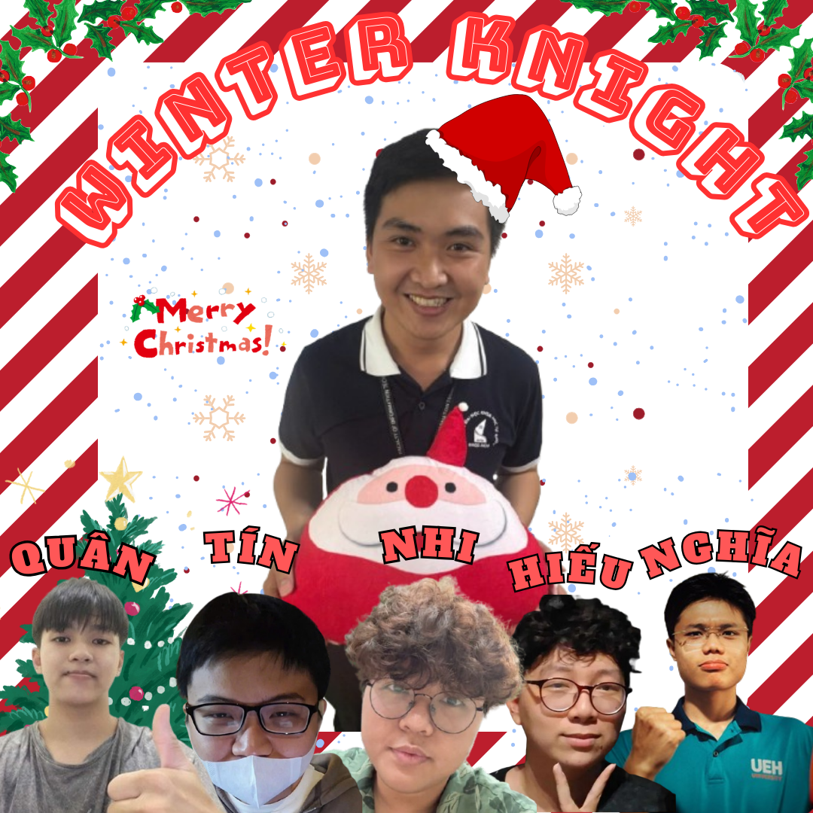
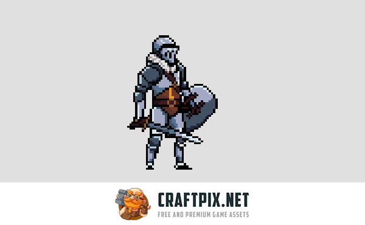
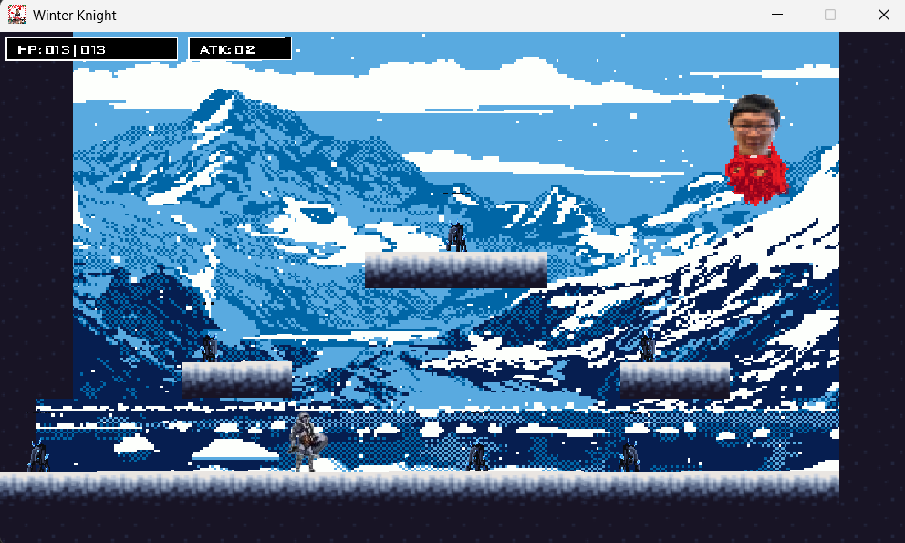
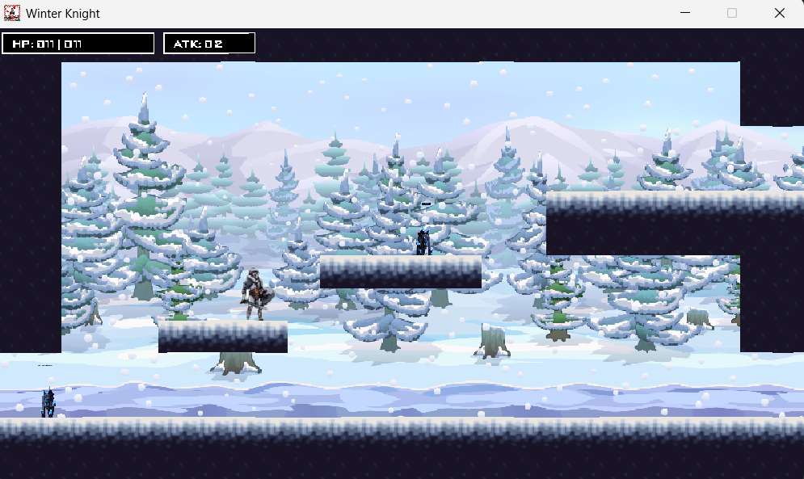

# A SIMPLE 2D METROIDVANIA PLATFORMER GAME: WINTER KNIGHT PROJECT

## THANK YOU
First and foremost, our group would like to express our sincere gratitude to our supervisor, Mr. Huynh Viet Tham, M.Sc., for creating favorable conditions for us to study and apply object-oriented programming knowledge through game design. This project has not only helped us gain practical experience but also stimulated our imagination and enhanced our creativity.

Due to limited time and our current level of understanding in the field of game programming, the project inevitably contains certain shortcomings. We sincerely look forward to receiving your valuable feedback and evaluations so that the game can be further improved in the future.

We would also like to extend our heartfelt thanks to all members of our group for their enthusiasm, cooperation, and mutual support throughout the process of completing this project. Each member’s contribution played an important role in overcoming challenges and achieving our shared goals. 

WE DID IT, TOGETHER!

*Merry Christmas!*

*December 24, 2025* 

## CONTRIBUTOR
- `31241020243` Cao Hà Nhi ([@nhicao31241020243-sketch](https://github.com/nhicao31241020243-sketch))
- `31241020557` Phan Lê Hiếu ([@PLHieu1212](https://github.com/PLHieu1212))
- `31241020795` Huỳnh Gia Tín ([@tinhuynh31241020795-jpg](https://github.com/tinhuynh31241020795-jpg))
- `31241024009` Đinh Sỹ Hoàng Quân ([@quantaplaptrinh](https://github.com/quantaplaptrinh))
- `31241024610` Trần Trung Nghĩa ([@nghialailaptrinh2006](https://github.com/nghialailaptrinh2006))

## INSPIRED GAME
The idea of our game is inspired by the famous 2D platformer game Super Mario, in which players control a character to overcome obstacles, collect items, and defeat enemies throughout different levels.

The game is titled “Winter Knight” and is set in a winter-themed environment, which is suitable for the time when this project is carried out, as Winter and Christmas are approaching. In the game, the player takes on the role of a UEH student who embarks on an adventure in a winter landscape, exploring various levels to search for treasures in order to pay off academic credit debts, while overcoming different challenges along the way.

The ultimate goal of the game is to defeat the final boss and complete the game. During gameplay, Christmas-themed items are randomly placed along the path to enhance the player’s abilities and increase the overall enjoyment and engagement of the game.

## REFERENCES
### *Fonts*
- License(s:https://creativecommons.org/publicdomain/zero/1.0/ 
- https://opengameart.org/content/public-pixel-font 
### *Music* 
- attack.wav: https://opengameart.org/content/jumping-man-sounds
- game-over.wav: https://www.myinstants.com/en/instant/phai-chiu-50387/
- hit-player.wav: https://opengameart.org/content/jumping-man-sounds 
- Background Music: https://www.youtube.com/watch?v=DhPYy7PhL_0
- Boss Music: https://www.youtube.com/watch?v=7XVBGAPY7W8
### *Characters* 
- Main Character: https://free-game-assets.itch.io/free-fantasy-knight
- Enemy Skeleton: https://monopixelart.itch.io/golems-pack 
- Enemies: Skull, Things, Boss (Designed by the team)
### *Items*
- Items: https://soda-1.itch.io/free-20-christmas-icon-pack-32x32
### *Background* 
- Winter Backgrounds: https://free-game-assets.itch.io/free-winter-nature-pixel-game-backgrounds
- Egyptian Background: https://free-game-assets.itch.io/free-ancient-temple-pixel-game-backgrounds
- Christmas Backgrounds: https://free-game-assets.itch.io/free-winter-holiday-2d-backgrounds
### *Supporting tools*
- Adobe photoshop
- Paint 3D 
- https://itch.io/
- https://www.leshylabs.com/apps/sstool/

## GALLERY

  

 

<h1 align="center">❄️ Winter Knight</h1>

  A 2D platformer game inspired by classic games like Super Mario, 
  set in a winter and Christmas-themed world.

<h2>🎮 Game Preview</h2>

<!-- Row 1: 15720 on the left, knights stacked vertically on the right -->
<table>
  <tr>
    <td style="vertical-align: top; padding-right: 16px;">
      
    </td>
    <td style="vertical-align: top;">
        
      
    </td>
  </tr>
</table>

 

<!-- Row 2: backgroundstart and boss1 side-by-side -->
<table>
  <tr>
    <td style="padding-right: 16px;">
      
    </td>
    <td>
      
    </td>
  </tr>
</table>

 

<!-- Row 3: christmas -->
  

<h2>🕹️ Features</h2>
<ul>
  <li>2D platformer gameplay</li>
  <li>Winter & Christmas-themed environment</li>
  <li>Animated knight character</li>
  <li>Enemies and boss battle</li>
  <li>Power-up items and collectibles</li>
</ul>

<h2>🛠️ Technologies</h2>
<ul>
  <li>Java</li>
  <li>IntelliJ IDEA</li>
</ul>

  © 2025 Winter Knight. All rights reserved. 
  December 24, 2025

