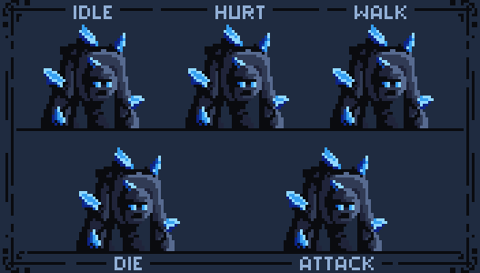

# A SIMPLE 2D METROIDVANIA PLATFORMER GAME: WINTER KNIGHT PROJECT

## THANK YOU
Firstly, on behalf of our team, we would like to extend our sincere thanks to our supervisor - Mr. Huynh Viet Tham, M.Sc., for having created favorable conditions for us in order to study and apply object-oriented programming knowledge in game designing. This project has not only provided us good experience, but it has also triggered our imagination and creativity.

Owing to the constraints of time and the present level of knowledge that we have acquired in the related area of game programming, we have some shortcomings within the project. We eagerly await your feedback and assessments so that some further improvements can be brought into the game.

We would also like to thank members of our group for their support and collaboration throughout this process in carrying out this project. The contributions that each member made played a very critical part in overcoming obstacles that were in the way for us to attain this goal.

WE DID IT, TOGETHER!

*Merry Christmas!*

*December 24, 2025* 

  

 

<h1 align="center">❄️ Winter Knight</h1>

  A 2D platformer game with a Winter and Christmas theme

## CONTRIBUTOR
- `31241020243` Cao Hà Nhi ([@nhicao31241020243-sketch](https://github.com/nhicao31241020243-sketch))
- `31241020557` Phan Lê Hiếu ([@PLHieu1212](https://github.com/PLHieu1212))
- `31241020795` Huỳnh Gia Tín ([@tinhuynh31241020795-jpg](https://github.com/tinhuynh31241020795-jpg))
- `31241024009` Đinh Sỹ Hoàng Quân ([@quantaplaptrinh](https://github.com/quantaplaptrinh))
- `31241024610` Trần Trung Nghĩa ([@nghialailaptrinh2006](https://github.com/nghialailaptrinh2006))

## SLIDE
- LINK: https://www.canva.com/design/DAG8TmdUuFc/fYjuVHCeV0EJa98mzXr6FA/edit?utm_content=DAG8TmdUuFc&utm_campaign=designshare&utm_medium=link2&utm_source=sharebutton

## INSPIRED GAME
The concept of our game is taken from the famous 2D platformer game Super Mario, where the player controls a character to overcome obstacles, collect items, and defeat enemies throughout different levels.

This game will be named "Winter Knight," and it will be set in a winter-themed environment, something suitable for the time this project is being carried out, since Winter and Christmas are coming up. The player in the game will be UEH's student on an adventure in a winter landscape: the player explores levels in search of treasures that would pay off academic credit debts while navigating various challenges.

The goal of the game is to kill the last boss and complete the game. In the process of playing the game, some Christmas-themed items are randomly put onto the path so as to enhance the capability of the player to increase the overall enjoyment and engagement with the game.

## REFERENCES
### *Fonts*
- License(s:https://creativecommons.org/publicdomain/zero/1.0/ 
- https://opengameart.org/content/public-pixel-font 
### *Music* 
- attack.wav: https://opengameart.org/content/jumping-man-sounds
- game-over.wav: https://www.myinstants.com/en/instant/phai-chiu-50387/
- hit-player.wav: https://opengameart.org/content/jumping-man-sounds 
- Background Music: https://www.youtube.com/watch?v=DhPYy7PhL_0
- Boss Music: https://www.youtube.com/watch?v=7XVBGAPY7W8
### *Characters* 
- Main Character: https://free-game-assets.itch.io/free-fantasy-knight
- Enemy Skeleton: https://monopixelart.itch.io/golems-pack 
- Enemies: Skull, Things, Boss (Designed by the team)
### *Items*
- Items: https://soda-1.itch.io/free-20-christmas-icon-pack-32x32
### *Background* 
- Winter Backgrounds: https://free-game-assets.itch.io/free-winter-nature-pixel-game-backgrounds
- Egyptian Background: https://free-game-assets.itch.io/free-ancient-temple-pixel-game-backgrounds
- Christmas Backgrounds: https://free-game-assets.itch.io/free-winter-holiday-2d-backgrounds
### *Supporting tools*
- Adobe photoshop
- Paint 3D 
- https://itch.io/
- https://www.leshylabs.com/apps/sstool/

## GALLERY

<h2>🎮 Game Preview</h2>

  

  
  
  

 

  

  

  

<h2>🕹️ Features</h2>
<ul>
  <li>2D platformer gameplay</li>
  <li>Winter & Christmas-themed environment</li>
  <li>Animated knight character</li>
  <li>Enemies including Golem and Boss</li>
  <li>Power-up items and collectibles</li>
</ul>

<h2>🛠️ Technologies</h2>
<ul>
  <li>Java</li>
  <li>IntelliJ IDEA</li>
</ul>

